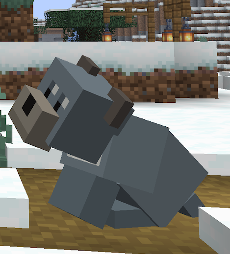

# Blue Staffy

<!-- Banner image — drop your PNG here and update the path below -->
<!--  -->

A Minecraft mod that adds the Blue Staffordshire Bull Terrier as a tameable companion — with its own personality, behaviours, and that unmistakable Staffy energy.

Built with [NeoForge](https://neoforged.net/) for Minecraft **1.21.11**.

---

## What's implemented

### Appearance
- [x] Custom entity model — Staffy proportions (wide skull, rose ears, barrel chest, short thick legs, stub tail)
- [x] Blue-gray texture with white chest blaze and small dark eyes
- [x] Baby/puppy variant via `BabyModelTransform`
- [ ] Proper Blockbench-quality texture
- [ ] Collar variants

### Behaviours
- [x] **Zoomies after eating** — feed your tamed Staffy any wolf food and it erupts into 6–9 seconds of excited sprinting (2.5× normal speed, tight erratic arcs). Overrides sit, follow, and wander goals entirely.
- [x] **Post-bath zoomies** — exiting water triggers a 3–5 second sprint. Classic Staffy behaviour.
- [x] **Zoomies after unsitting** — right-click to unsit and the dog bolts off for 3–5 seconds.
- [x] **Collision damage while zooming** — anything the Staffy runs into (mobs, players, armour stands) takes 1.5 damage (¾ heart) with a 1-second cooldown between hits.
- [x] **Bark on zoomies start** — uses the wolf's variant bark/growl sound the moment zoomies begin.
- [x] **Idle head tilt** — while standing still the head gently tilts side-to-side (~10°, ~1.7 s period). Stops the moment the dog starts moving.
- [x] **Resting whimper** — occasional soft whimper sound while sitting (~25 s average gap).
- [x] Taming, sitting, following, and loyalty (inherited from Wolf)
- [x] Idle oink/snort sounds
- [ ] Unique idle animations (wiggle bum)
- [ ] Sounds (growls, excited barking)

### Future
- [ ] Puppy variant (model layer exists; texture and behaviour pending)
- [ ] Toy interactions
- [ ] Named dog support

---

## Installing the mod in Minecraft Java Edition

### Prerequisites
1. **Minecraft Java Edition** (version 1.21.11)
2. **NeoForge 21.11.42** — download the installer from [neoforged.net](https://neoforged.net/) and run it:
   ```
   java -jar neoforge-21.11.42-installer.jar
   ```
   This creates a NeoForge profile in the Minecraft Launcher.

### Build and install

```bash
make build          # compiles and packages the mod
make jar            # prints the JAR path once built
```

Copy the JAR printed by `make jar` into your Minecraft mods folder:

| OS | Mods folder |
|---|---|
| macOS | `~/Library/Application Support/minecraft/mods/` |
| Windows | `%APPDATA%\.minecraft\mods\` |
| Linux | `~/.minecraft/mods/` |

Create the `mods/` folder if it doesn't exist.

### Launch

1. Open the Minecraft Launcher
2. Select the **NeoForge 1.21.11** profile
3. Click **Play**

In-game, switch to **Creative mode**, open the **Blue Staffy** tab, and use the spawn egg to summon one — or run:
```
/summon bluestaffy:blue_staffy
```

---

## Development setup

### Requirements
- Java 21
- [IntelliJ IDEA](https://www.jetbrains.com/idea/) (recommended) or Eclipse

### Quick reference

```bash
make build   # compile and package
make run     # launch Minecraft client for live testing
make clean   # wipe build artefacts
make deps    # force-refresh dependencies if something breaks
```

### Refresh dependencies if something breaks

```bash
make deps
```

---

## Project structure

```
src/main/java/ai/gamu/bluestaffy/
  BlueStaffy.java              # Mod entry point, registrations
  BlueStaffyClient.java        # Client-only setup (renderers, model layers)
  Config.java                  # Mod config
  entity/
    BlueStaffyEntity.java      # The dog entity — all server-side behaviours
    goal/
      ZoomiesGoal.java         # AI goal: 2.5× speed erratic sprint, priority 0
      GreetOwnerGoal.java      # Reserved: greeting behaviour (not yet active)
  client/
    model/
      BlueStaffyModel.java     # Custom entity model + idle head tilt animation
    renderer/
      BlueStaffyRenderer.java  # Entity renderer

src/main/resources/assets/bluestaffy/
  textures/entity/             # Entity skin (64×64, blue-gray + white chest blaze)
  textures/item/               # Spawn egg texture
  models/                      # Item + block models
  items/                       # Item definitions (1.21.11 format)
  blockstates/                 # Block state definitions
  lang/en_us.json              # Translations
```

---

## Tech stack

| | |
|---|---|
| Minecraft | 1.21.11 |
| Mod loader | NeoForge 21.11.42 |
| Language | Java 21 |
| Build tool | Gradle (via `make`) |
| Mappings | Parchment 2025.12.20 |

---

## Notes for contributors

- Entity model work is done in [Blockbench](https://www.blockbench.net/) — export as a Java entity model
- `BlueStaffyEntity` extends `Wolf`, giving taming, pathfinding, and sitting for free. Custom behaviours are added as AI goals
- Item models use the 1.21.11 `assets/<mod>/items/` definition format alongside traditional `models/item/` files
- Run `make run` to test — no need to install the mod separately during development

---

## License

All Rights Reserved — [iamgaru](https://github.com/iamgaru)
